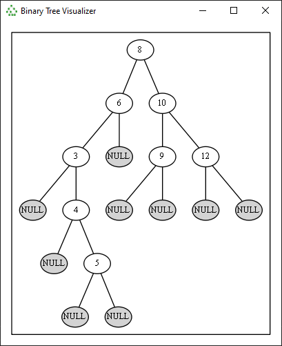

# Binary Tree Visualizer

The app is based on [this blog post](http://mkaczanowski.com/binary-tree-visualization/).

## Info

* Written using Python and PyQt5
* Calls Graphivz to produce the images. See [here](https://www.graphviz.org/). This application should be installed and added to PATH for the app to work.

## Screenshots

